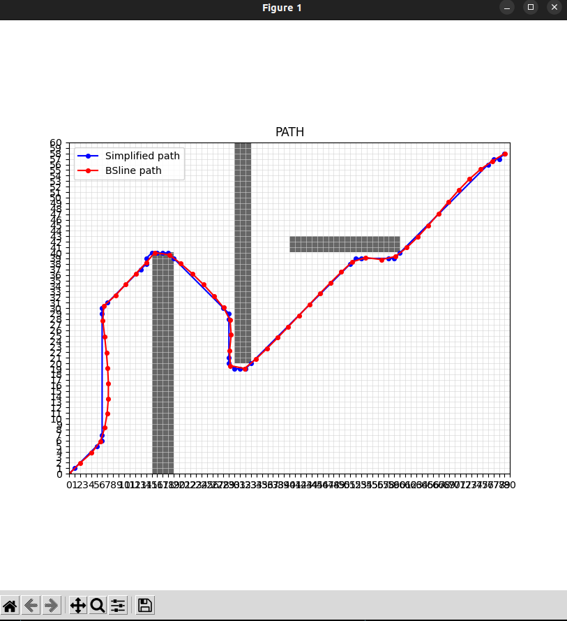
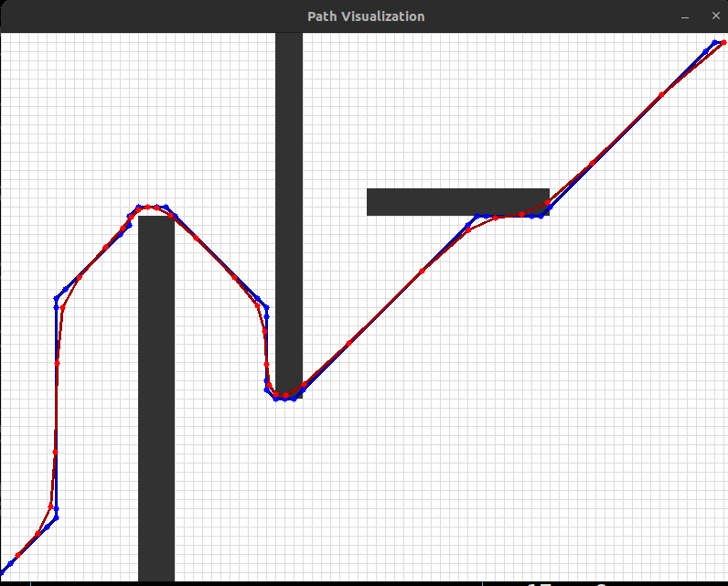

# A*+B样条曲线平滑算法（自带路径简化）

## 1.项目介绍

本项目实现了A*+B样条曲线平滑的算法，提供 C++ 与 Python 两种版本，可用于机器人路径规划；
对于曲线平滑原理的简单解释（包含贝塞尔曲线与B样条曲线），可见文件：[曲线平滑原理解释.md](曲线平滑原理解释.md)

项目文件可视化截图：

Python:

C++:

## 2.使用方法

对于Linux操作系统：

运行 astar_bsline.py:

    python3 python3 B-spline/astar_bsline.py 

 
运行 astar_bsline.cpp:

编译：（opencv、eigen3 的路径如有不同请自行更改）

    g++ -std=c++17 B-spline/astar_bsline.cpp -o astar_bspline -I /usr/include/eigen3 `pkg-config --cflags --libs opencv4`

运行：

    ./astar_bspline 

### 声明
    

## 3.作者

- [Gerry Liu](https://github.com/Gerrylgr?tab=repositories)